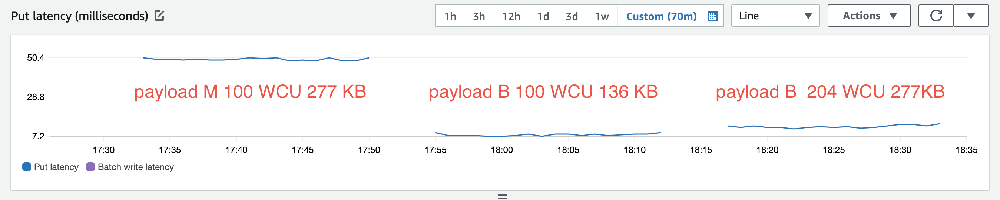

DynamdoDb M payload latency anomaly
===================================

The tests were performed on Heroku `private-l` dyno running in Virginia, United States, Heroku region against a DynamoDb table in `us-east-1` AWS region. The DynamoDb table had `10_000` RCU/WCU provisioned read/write capacity. For each request body "shape", the test was performed 1000 times. Rate of requests was limited at 2 per second to avoid server-side request throttling. The test measured time to execute HTTPS `POST` request, i.e. time to construct payload body is not part of the reported average execution time.

Test results [test-2022-02-18.log](test-2022-02-18.log) (times are UTC)

Payload shape                     | Average time, ms | Payload description
----------------------------------|------------------|-----------------------------------
`payload_m_100wcu_277kb.json`     | 63.586           | map, 100 WCUs, 277 KB body size
`payload_b_100wcu_136kb.json`     | 14.094           | binary, 100 WCUs, 136 KB body size
`payload_b_204wcu_277kb.json`     | 19.685           | binary, 204 WCUs, 277 KB body size

CloudWatch Put latency during the test execution:

## Test sources

